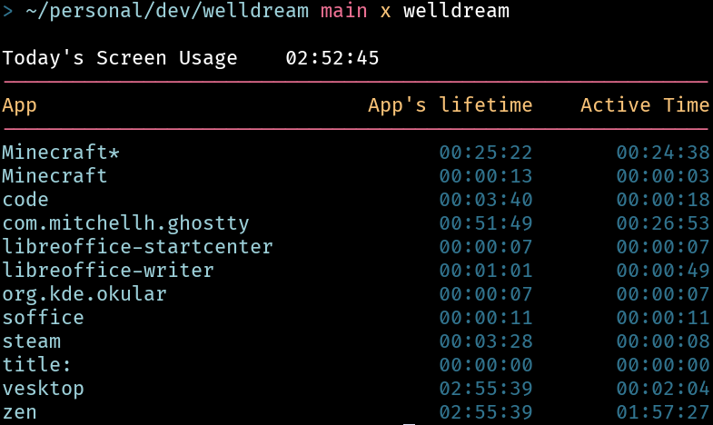

# Welldream

> [!WARNING]
> This project only supports Hyprland

Log and display your app usage



## Usage
- `welldream -s` or `welldream --server` start the server
  - you can also use the provided systemd service file to start it as a daemon instead
    (place the welldream.server in `~/.config/systemd/user/`
    and then run `systemctl --user start welldream.service`
    or `systemctl --user enable --now welldream.service`(for persistent between boots))
- `welldream` show the usage of the current day

`--debug` can be used to show debug info

## Cache
It keeps cache here `~/.cache/welldream`

## Build
### First option
Compile the project:
```bash
go build
```
you can then move the `welldream` binary wherever you want

### Second option
Use the Makefile:
```
make
```
the binary will be put in `$HOME/.local/bin/`


## todo
 - [ ] add weekly report
 - [ ] add monthy report
 - [x] add sorting
 - [ ] change sorting to sort by most used app instead of alphabetically
 - [ ] IMPORTANT: switch to using Hyprland's IPC instead of polling every second
