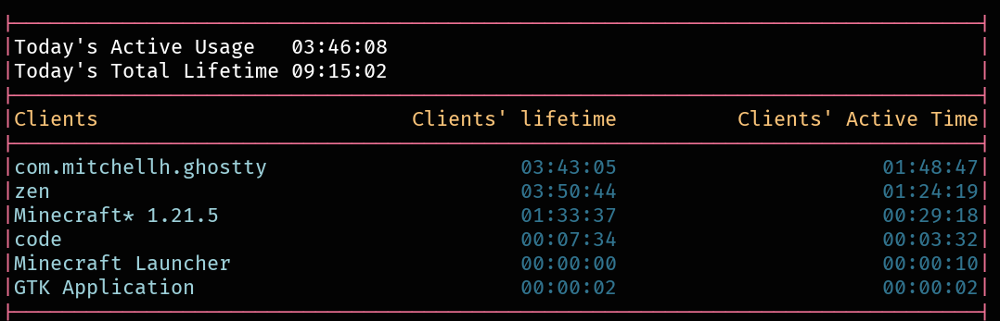

# Welldream

> [!WARNING]
> This project only supports Hyprland

Log and display your app usage



## Usage
- add `server` to start the server
- add `watch` to start watching
- add `debug` to print debug info
- nothing print the usage then exists

- `welldream server` will start the server
- `welldream server debug` will start the server and debug
- `welldream server watch debug` will start the server, watcher and debug
- `welldream` will only print the usage
> `server`, `watch` and `debug` are optional and can be in any order

## Cache
It keeps cache here `~/.cache/welldream`

## Build
### First option
Compile the project:
```bash
go build
```
you can then move the `welldream` binary wherever you want

### Second option
Use the Makefile:
```
make
```
the binary will be put in `$HOME/.local/bin/`


## todo
 - [ ] add weekly report
 - [ ] add monthy report
 - [x] add sorting
 - [ ] change sorting to sort by most used app instead of alphabetically
 - [x] IMPORTANT: switch to using Hyprland's IPC instead of polling every second
